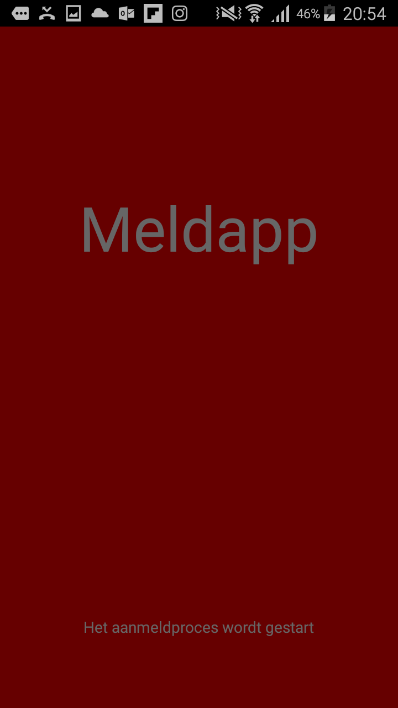
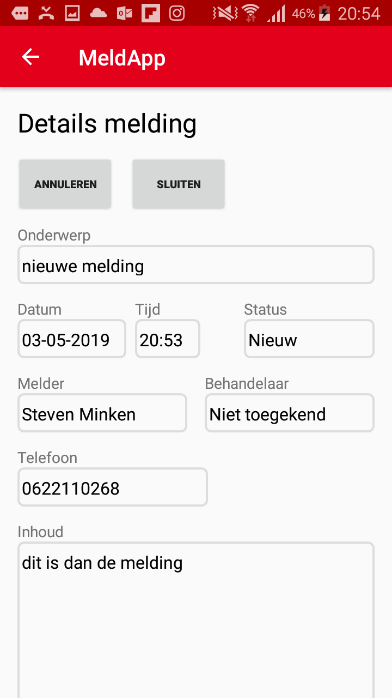
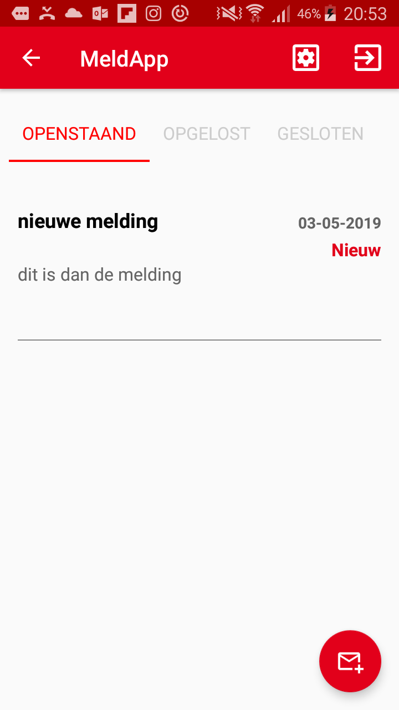
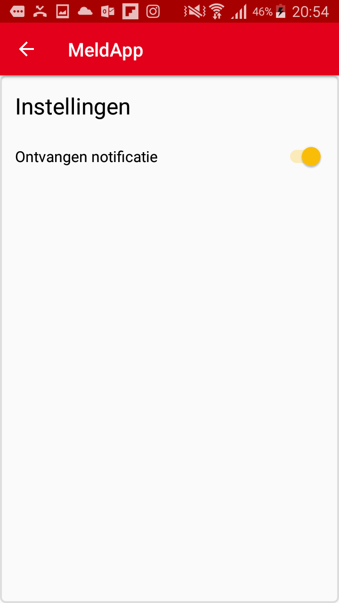

# meldApp

Deze app maakt het mogelijk voor klanten(hierna genoemd: melders) van servicebedrijven direct in contact te komen met een servicemonteur (hierna genoemd: behandelaar). Op deze wijze worden problemen bij klanten sneller opgelost wat de winstgevendheid kan bevorderen en de klanttevredenheid verbeterd.

Android app ten behoeve van de eindopdracht <b>CPP java/ android programmeur bij de Open Universiteit Nederland</b>. (december 2018). De App is gemaakt in groepsverband met vier personen. Er is gebruikgemaakt van <b>Slack</b> voor regelmatig overleg en <b>Gitlab</b> voor versiebeheer. 
Voor de database wordt gebruikgemaakt van de <b>Firebase</b> realtime database (Google). Voor het verzenden van notificaties is gebruik gemaakt van een externe server die een luisteraar heeft op de database. 

## Getting Started

De code kan via android studio gecompileerd worden op een android toestel via usb of kan gedraaid worden op een emulator. 
De server voor het verzenden van notificaties was alleen online tijdens het project. 
De firebase database is momenteel (nog) functioneel (juni 2019).
Om een gebruiker aan te melden is een actie van de administrator nodig. Stuur me een bericht wanneer u de code wens te testen.

### Prerequisites

Om de app te kunnen draaien is android studio vereist.

Voor het aanmelden is gebruikt van Google authentication om de gebruiker te kunnen verifieren. Deze wordt bij de aanmelding ook geverifieerd door de administrator. Wanneer de gebruiker voorkomt als valide gebruiker dan kan deze de app gebruiken.
 

Een gebruiker die geregisteerd is als melder kan een melding aanmaken.
 

Deze melding komt dan te staan in het scherm overzicht meldingen. Wanneer een behandelaar de melding afhandeld verschuift de melding naar gesloten en dan kan deze bevestigen dat de melding naar wens is afgehandeld.
 

Wanneer een melding is gesloten kan de melder daarvan een notificatie ontvangen indien deze dat wil.
 

## Running the tests

Testen zijn steekproefsgewijs toegepast op klassen in de diverse domeinlagen. 
De datalaag test of de data juist wordt toegevoegd in de firebase database.

### Architectuur

Er is gekozen om de app op te bouwen uit diverse domeinlagen. De datalaag zorgt voor de interactie met de database. 
De domeinlaag bevat de feitelijke klassen zoals de melding, de aantekening en o.a. enums voor de status en de rol van de gebruiker. 
De viewlaag bevat de activities en zorgt voor interactie met de gebruiker. 
Het viewmodel ondersteund de activities en zorgt voor de interactie met de datalaag.

## Built With

* Android Studio
* Gradle
* Firebase
* Java

## Versioning

Versiebeheer is verwijderd ivm met de privacy van de overige teamleden.

## Authors

anoniem

